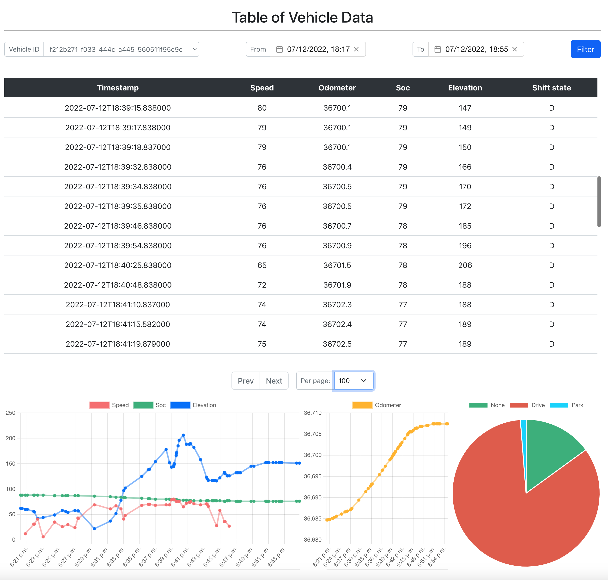

# ev-data-viewer
FastAPI serving EV vehicle data to a simple Vue.js 3 frontend displaying vehicle data with plots and filtering options

## Install
    $ make install

## Run preview of the application
	
    $ source server/venv/bin/activate;
    $ export PYTHONPATH=$(pwd)
	$ python server/main.py
	
    In a separate shell run:
    $ cd client
    $ npm run dev

    Or run a preview of production:
    $ npm run build && npm run preview

## Use it

    
A chrome tab is opened once the app is launched.

The API is accessible under .../app/v1/docs. In the swagger page it is possible to upload CSV files with vehicle data, following the same structure as the example files under /db_utils/data/.

The frontend presents a table with vehicle datapoints and allows filtering by vehicle id and a date range.
The datapoins in the page are ploted in the bottom charts. The charts are interactive and allow disabling lines.

## Credits

This demo app is built with super cool open source projects:

- [vue-chartjs](https://vue-chartjs.org/) for the charts
- [vue3-datepicker](https://vue3datepicker.com/) for the datepicker popovers
- [vuejs-paginate-next](https://www.npmjs.com/package/vuejs-paginate-next) for the pagination component
- [fastapi_pagination](https://uriyyo-fastapi-pagination.netlify.app) for the backend pagination

